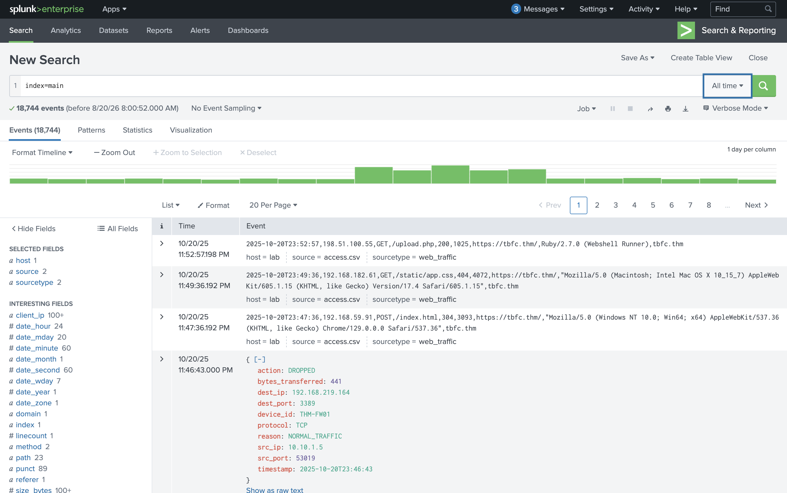
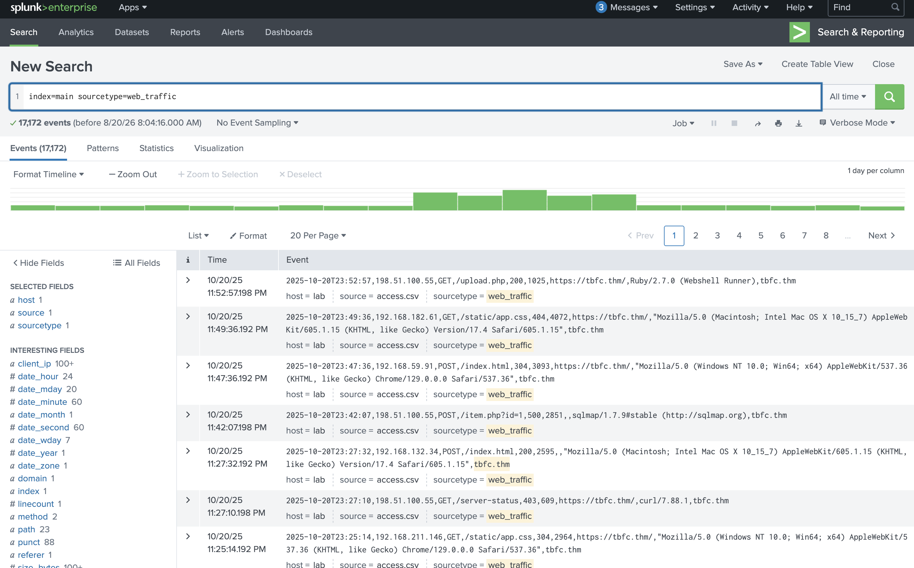
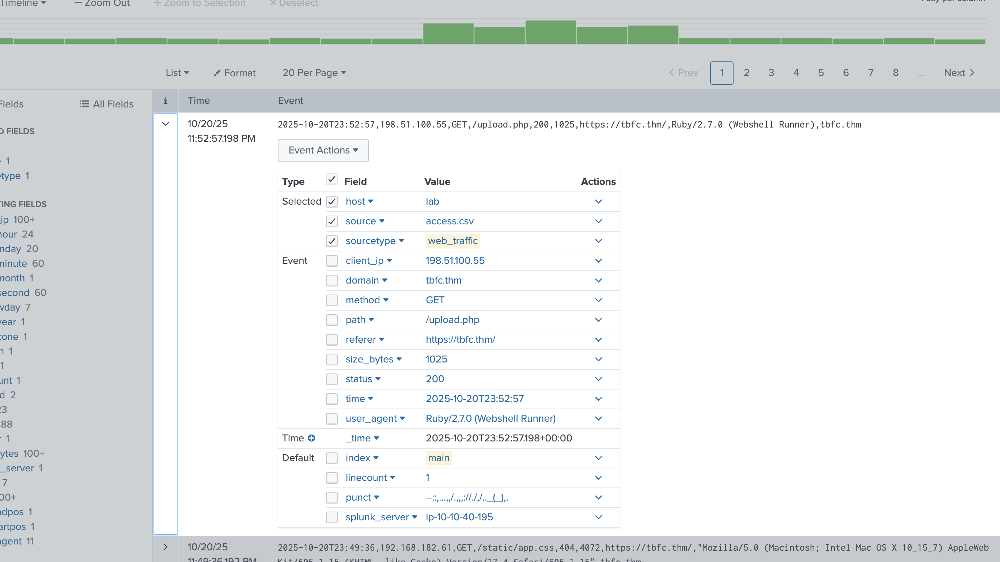
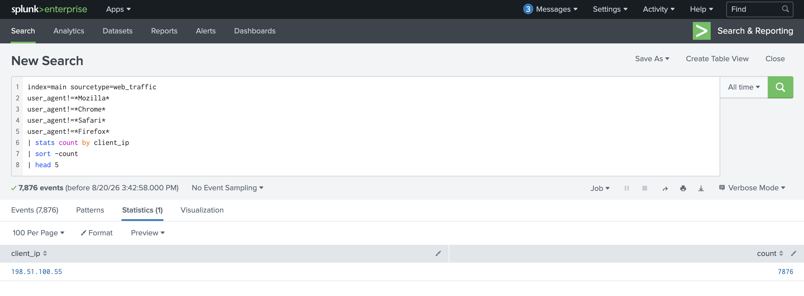
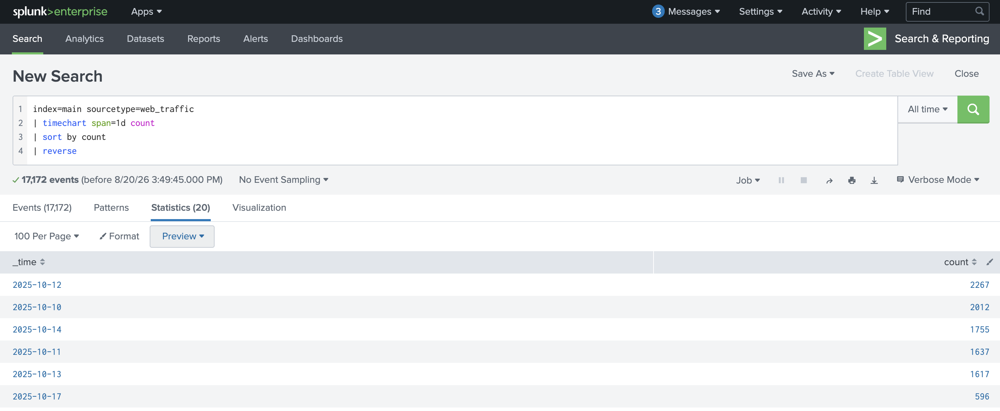
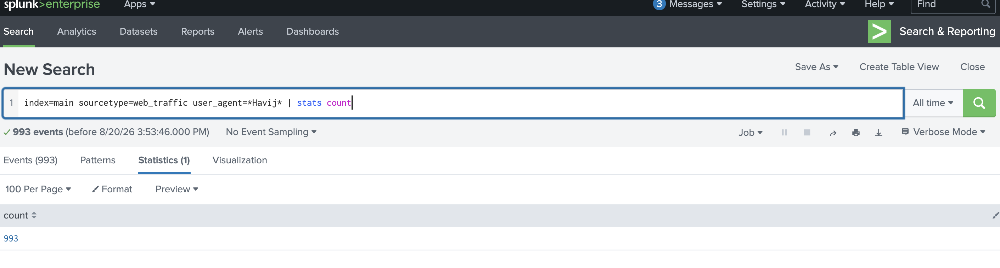
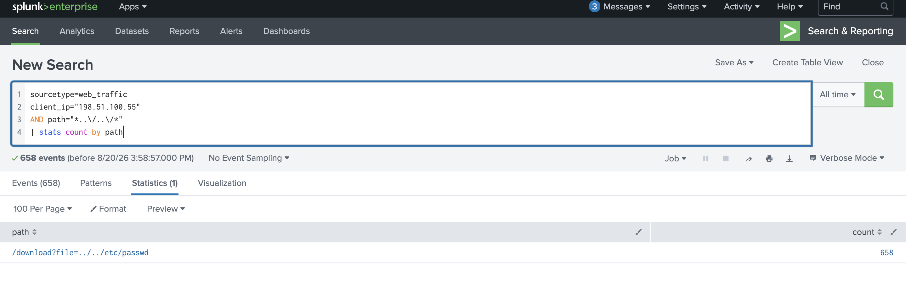
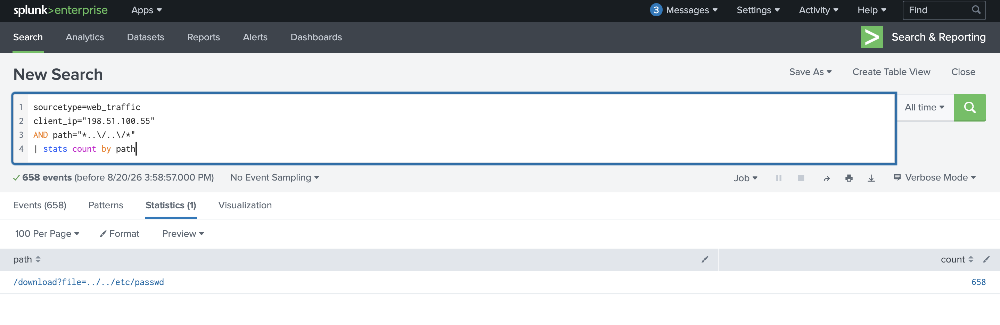
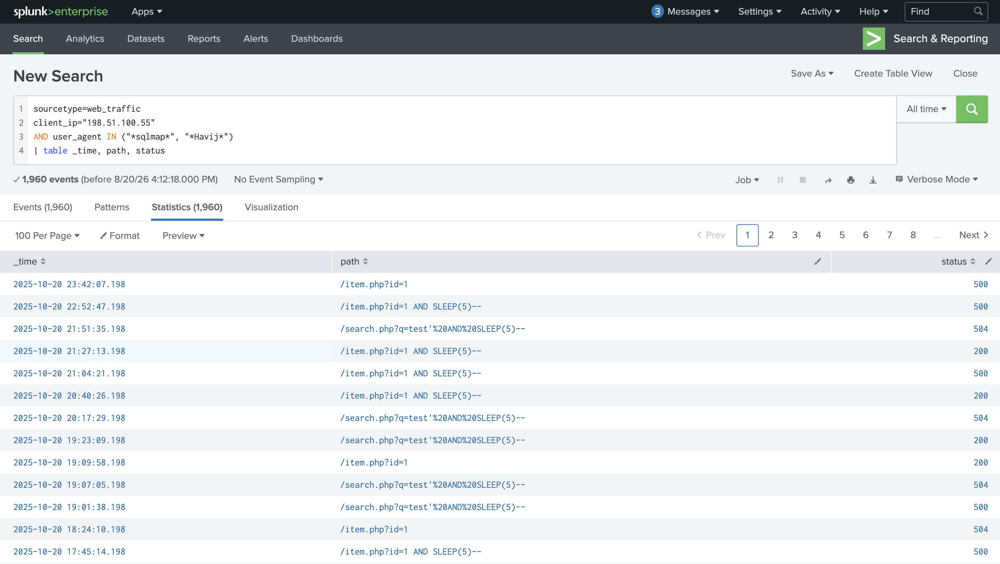

<p align="center">
  
</p>

$$
\huge \begin{array}{c} \mathbf{\textsf{Royal University of Bhutan,}} \\ \mathbf{\textsf{College of Science and Technology}} \end{array}
$$

$$
\Large \mathbf{\textsf{SWS405: Digital Forensics}}
$$

$$
\Large \mathbf{\textsf{Computing Technologies Department  }}
$$

$$
\large \mathbf{\textsf{Lab Report 1  }}
$$

$$
\large \mathbf{\textsf{Submitted by: Sonam Dorji Ghalley  }}
$$

$$
\large \mathbf{\textsf{Student No: 02230299  }}
$$

## 1. Aim

The purpose of this lab was to gain practical experience with using Splunk as a Security Information and Event Management (SIEM) tool for analyzing security-related logs and investigating security events. The lab also provided an opportunity to rebuild a ransomware attack scenario based on the information found in web, firewall, Sysmon, and IIS logs.

## 2. Objectives

The objectives of this lab were to:

- Use Splunk Search & Reporting to search and analyse security events.
- Understand the use of indexes, sourcetypes and fields in Splunk.
- Apply SPL commands such as `stats`, `table`, `timechart`, `sort` and filtering conditions.
- Identify abnormal web traffic and distinguish malicious activity from legitimate traffic.
- Identify an attacker IP address and reconstruct the stages of a web attack.
- Correlate web traffic with firewall logs to identify command-and-control communication and data transfer.
- Analyse Windows Sysmon logs to identify suspicious file creation, processes and command-line activity.
- Identify process injection/migration and credential-access activity.
- Use IIS logs to identify a malicious web shell.
- Investigate indicators associated with a simulated Conti ransomware compromise.

## 3. What I Understood (Pre-Lab Summary)

### 3.1 What is Splunk / a SIEM, and why does it matter here?

A Security Information and Event Manager (SIEM) is a security platform that collects and centralises logs from various systems so that security analysts can search, cross-reference and investigate events in one place.

Splunk can be used as a SIEM since it enables users to leverage large volumes of machine data by performing searches using the Splunk Query Language. Instead of sifting through each log file on different computers, servers, and firewalls, an analyst can perform a search in Splunk to find any suspicious data.

This was crucial during the labs since the evidence for the attack was found in a plethora of different logs. For instance, the attack traffic was seen in web traffic, firewall logs, Sysmon, and IIS logs showed the web shell deployment.

### 3.2 What is the scenario in each lab?

#### Lab 1 - Splunk Basics: “Did you SIEM?”

The first lab was an investigation of a hypothetical attack scenario involving a web server. The data about web traffic and the firewall logs were already loaded in Splunk. The task was to determine the source of the attack, find out the peak activity time of the attacker, examine the suspicious requests and see if the web server was communicating with the C2 server of the attacker.

The investigation included the following steps: identification of reconnaissance and vulnerability scanning activities, determining the time of the attack, finding peak activity of various types of attacks such as SQL injection, path traversal, data exfiltration, web-shell attacks, and checking if ransomware was launched.

#### Lab 2 - Conti Ransomware Investigation

The second lab involved a Microsoft Exchange server that was already compromised. Employees could not access Outlook or the Exchange Administrative Center, and “ransom-note” files appeared on the server: The goal of the analysis was to find where exactly the ransomware was on the Exchange server by examining Splunk data, including Sysmon, Windows, and IIS logs. It was also needed to determine the hash of the ransomware, see if it had persistence or used process injection to infiltrate the system, identify any credential-access activities, and find the web shell used to deliver the ransomware during the attack.

### **3.3 What is Conti ransomware, in brief?**

Conti is a ransomware that is associated with specific targeted attacks. In most cases, Conti ransomware operators attempt to steal sensitive information before encrypting the data on the targeted system. This cybercrime phenomenon is manifested by dual extortion where victims are threatened with the release of their data or loss of access to their systems due to encryption.

Therefore, the analysis of such attack should include investigations of encrypted data, possible data exfiltration. Evidence of initial access, command and control, privilege escalation, credential access, and persistence should also be taken into account.

## 4. Tools & Environment

**Tool used:** Splunk Enterprise – Search & Reporting

**Platform:** TryHackMe

**Lab 1 Splunk Instance:**

`https://LAB_WEB_URL.p.thmlabs.com`

**Lab 2 Splunk Instance:**

`http://MACHINE_IP:8000`

**Lab 2 Splunk Username:** `bellybear`

**Lab 2 Splunk Password:** `password!!!`

The time range was changed to **All time** during the investigations so that all events contained in the lab datasets were included.

## **5. Procedure – Lab 1: Splunk Basics (“Did you SIEM?”)**

### 5.1 Accessing and Exploring the Logs

I started the TryHackMe lab machine and opened the provided Splunk instance. And from the Splunk home page, I selected **Search & Reporting**.

I first searched all available data using:

```
index=main
```

I changed the time range to **All time**.

The `sourcetype` field showed two main datasets:

- `web_traffic`
- `firewall_logs`

The `web_traffic` data contained requests made to the web server, while `firewall_logs` showed network traffic that was allowed or blocked.



### **5.2 Examining Web Traffic**

I made the search more specific to web traffic using:

```
index=main sourcetype=web_traffic
```

This displayed the web requests and several useful fields including:

- `client_ip`
- `user_agent`
- `path`
- `status`

These fields were used to investigate suspicious requests.





### 5.3 Identifying the Attacker IP Address

Normal web browsers usually contain user-agent strings such as Mozilla, Chrome, Safari or Firefox. I filtered these common browser values to focus on traffic generated by scripts  or and brute force method and attack tools.

```
index=main sourcetype=web_traffic
user_agent!=*Mozilla*
user_agent!=*Chrome*
user_agent!=*Safari*
user_agent!=*Firefox*
| stats count by client_ip
| sort -count
| head 5
```

The suspicious traffic originated from one IP address.

**Result:**

```
198.51.100.55
```

Therefore, the identified attacker IP address was **198.51.100.55**.



### 5.4 Identifying the Peak Traffic Day

I used the `timechart` command to calculate the number of web events recorded each day.

```
index=main sourcetype=web_traffic
| timechart span=1d count
| sort by count
| reverse
```

The results showed a vast increase in web activity on one particular day.

**Result:**

```
2025-10-12
```

Therefore, the peak traffic occurred on **12 October 2025**.



### 5.5 Identifying Havij Activity

I searched  for the Havij user agent as the question asked. Havij is associated with automated SQL injection testing.

```
index=main sourcetype=web_traffic user_agent=*Havij*
| stats count
```

**Result:**

```
993
```

A total of **993 Havij events** were identified.



### **5.6 Investigating Path Traversal Attempts**

Then I  searched for requests from the attacker IP containing the `../../` pattern, which shows  attempts to move through directory levels and access files outside the intended web directory.

```
sourcetype=web_traffic
client_ip="198.51.100.55"
AND path="*..\/..\/*"
| stats count by path
```

The total number of path traversal attempts was:

```
658
```

Therefore, **658 path traversal attempts** were observed.



### 5.7 Examining Reconnaissance Activity

I searched and looked for attempts to access common configuration or information-disclosure filesthat the attacker might have done something like that.

```
sourcetype=web_traffic
client_ip="198.51.100.55"
AND path IN ("/.env", "/*phpinfo*", "/.git*")
| table _time, path, user_agent, status
```

The search showed the attacker was searching in the server for exposed files and configuration information.



### 5.8 Examining SQL Injection Activity

I searched for traffic that came with SQL injection tools such as SQLmap and Havij.

```
sourcetype=web_traffic
client_ip="198.51.100.55"
AND user_agent IN ("*sqlmap*", "*Havij*")
| table _time, path, status
```

The results showed automated SQL injection activity and suspicious request payloads.



upon checking one of the activities i could see this. indicating SQL injection activity was done 


### **5.9 Identifying Ransomware Staging and Web-Shell Activity**

I searched for suspicious requests associated with the ransomware binary and web shell.

```
sourcetype=web_traffic
client_ip="198.51.100.55"
AND path IN ("*bunnylock.bin*", "*shell.php?cmd=*")
| table _time, path, user_agent, status
```

The logs  showed that a web shell had been used to execute commands on the compromised server. The request containing:

```
shell.php?cmd=./bunnylock.bin
```

indicating execution of the ransomware related binary.


### 5.10 Correlating Firewall Logs

After find ing out the attacker in the web logs, I moved to the firewall logs to determine whether the compromised server communicated back with the attacker.

```
sourcetype=firewall_logs
src_ip="10.10.1.5"
AND dest_ip="198.51.100.55"
AND action="ALLOWED"
| table _time, action, protocol, src_ip, dest_ip, dest_port, reason
```

The firewall events confirmed that an outbound connection from the compromised server to the attacker-controlled address had been allowed.


### 5.11 Calculating Data Transferred to the C2 Server

Finally, I calculated the total data transferred from the compromised server to the attacker's IP.

```
sourcetype=firewall_logs
src_ip="10.10.1.5"
AND dest_ip="198.51.100.55"
AND action="ALLOWED"
| stats sum(bytes_transferred) by src_ip
```

**Result:**

```
126167 bytes
```

Therefore, **126,167 bytes** were transferred to the command-and-control server.


## **6. Procedure – Lab 2: Conti Ransomware Investigation**

### 6.1 Accessing the Splunk Instance

I started the lab and accessed Splunk using:

```
http://MACHINE_IP:8000
```

I set the time range to **All time** and initially searched:

```
index=*
```

This provided an overview of the logs available for the compromised Exchange server.


### 6.2 Identifying the Location of the Ransomware

since a  suspicious file creation was involved, I investigated Sysmon file-creation events and examined the `Image` field.

A useful search was:

```
index=* EventCode=11
| stats count by Image
```

A `cmd.exe` executable appeared in a highly unusual location:

```
C:\Users\Administrator\Documents\cmd.exe
```

A Windows `cmd.exe` would normally be found inside a Windows system directory rather than the Administrator's Documents directory. Which is not something to happen usually.


### 6.3 Identifying the Sysmon File Creation Event ID

After googling i found out that Sysmon records file creation activities using **Event ID 11**.


### 6.4 Finding the MD5 Hash of the Ransomware

I filtered events related to the suspicious executable and examined the `Hashes` field.

```
index=*
Image="C:\\Users\\Administrator\\Documents\\cmd.exe"
| table _time, Image, Hashes
```


### 6.5 Identifying the File Saved in Multiple Locations

I again examined Sysmon Event ID 11 and checked the `TargetFilename` field.

```
index=* EventCode=11
Image="C:\\Users\\Administrator\\Documents\\cmd.exe"
| stats count by TargetFilename
```

The search showed that one file had been created in many different folders.


### 6.6 Identifying the Command Used to Create a New User

I searched command-line activity for the `/add` parameter.

```
index=* CommandLine="*/add*"
| table _time, CommandLine
```


### 6.7 Investigating Process Migration

To investigate process injection or migration, I searched for **Sysmon Event ID 8**, which records CreateRemoteThread activity.

```
index=*
sourcetype="WinEventLog:Microsoft-Windows-Sysmon/Operational"
EventCode=8
| table SourceImage, TargetImage
```

The results showed:

**Original/source process:**

```
C:\Windows\System32\WindowsPowerShell\v1.0\powershell.exe
```

**Migrated/target process:**

```
C:\Windows\System32\wbem\unsecapp.exe
```

This indicated that malicious execution originating from PowerShell was moved into the legitimate `unsecapp.exe` process.


### 6.8 Identifying the Process Used to Retrieve System Hashes

The same Event ID 8 results showed another process migration:

```
unsecapp.exe → lsass.exe
```

The target process was:

```
C:\Windows\System32\lsass.exe
```

LSASS handles Windows authentication information and is therefore a common target during credential-access activity.


### 6.9 Identifying the Web Shell

I then changed from Sysmon logs to IIS logs because IIS records requests made to web applications hosted on the Exchange server.

I searched for HTTP POST requests:

```
index=* sourcetype=iis cs_method=POST
| table _time, cs_uri_stem, c_ip
```

I examined the `cs_uri_stem` field and found a suspicious ASP.NET file  with a randomly generated name:

```
i3gfPctK1c2x.aspx
```


### 6.10 Identifying the Command Line Associated with the Web Shell

After finding the web-shell filename, I pivoted back to the endpoint logs and searched for the filename.

```
index=* "i3gfPctK1c2x.aspx"
| table _time, CommandLine
```

The command identified was:

```
attrib.exe -r \\win-aoqkg2as2q7.bellybear.local\C$\Program Files\Microsoft\Exchange Server\V15\FrontEnd\HttpProxy\owa\auth\i3gfPctK1c2x.aspx
```

The command modified the attributes of the malicious ASPX file.


### 6.11 Identifying the CVEs

The final task required identifying the three CVEs associated with the attack information referenced by the challenge.

In ascending order, the expected lab answer is:

```
CVE-2018-13374
CVE-2018-13379
CVE-2020-0796
```

## 7. Questions

#### 1. What is the difference between an index, a sourcetype, and a field in Splunk?

An index - is the logical place in Splunk where the event data resides and gets searched. For instance, in our first lab, the Splunk’s main `index` was used.

A source type - describes the nature of the data and instructs Splunk how to parse and index the data. `Web_traffic`, `firewall_logs,` Sysmon and IIS are some of the sourcetypes used in this lab.

A field – is a name-value pair extracted from the event. Some of the fields used in the labs are `client_ip`, `user_agent`, `Image,` `CommandLine`, `TargetFilename` and `status`.

Hence, in summary, one can state that index specifies where the events are stored. Source type, in its turn, describes what the events are about. Fields finally, represent specific pieces of information in the events.

#### 2. What does the pipe ( | ) operator do in SPL, and why is it central to how Splunk searches work?

The pipe operator passes the results produced by the command on its left to the command on its right.

For example:

```
index=main sourcetype=web_traffic
| stats count by client_ip
| sort -count
```

The first command selects the web events, the second command calculates the number of events per ip address, and the third command sorts the results in descending order.

The pipe operator allows to split a complex investigation into multiple steps, and for each such step, the commands act upon the results of the previous command, thus allowing to narrow down, transform and summarize the data as needed

#### 3. What is the purpose of the “Interesting Fields” panel, and how did it help you during this investigation?

The Interesting Fields panel lists the fields that have been identified in the events found from the search. This allows a faster overview of what information is available without having to check each individual event.

During the course, fields such as

- `client_ip`
- `user_agent`
- `path`
- `Image`
- `Hashes`
- `CommandLine`
- `TargetFilename`
- `SourceImage`
- `TargetImage`

were found interesting during the investigation.

For example, the Image field was useful in identifying the suspicious ransomware location, while the CommandLine was useful in identifying the attacker’s account creation command. During Lab 1, the client_ip field was used to find the malicious IP address.

#### **4. Why is choosing the correct time range important in Splunk, and what could go wrong if it is set incorrectly?**

The time range determines what events Splunk pulls in for a search

If it's set too small, the analyst might miss out on important evidence and wrongly assume that something didn't happen. An example of this would be if they left it on the last 24 hours in these labs, they would have gotten next to nothing as most of the attack logs took place much earlier.

A range that's too large on the other hand, especially in a large scale environment, would include an unwieldy amount of irrelevant information and take much longer to search through.

The point is that having a proper time range is crucial to getting the full story that the analyst needs to have a complete picture of the events that took place.

#### 5. How would you make a search you wrote today reusable as an alert that fires automatically in the future?

After creating and testing the SPL search, I would select:

**Save As → Alert**

I would then:

1. Give the alert a descriptive name.
2. Select whether it should run on a schedule or in real time.
3. Configure the search time range.
4. Define the trigger condition.
5. Configure an action such as sending an email notification.
6. Save and enable the alert.

For example, a search detecting suspicious Havij traffic could be converted into an alert so that future matching events automatically notify the security team. Splunk alerts are based on saved searches and trigger when configured conditions are satisfied.

#### 6. Why did the analyst pivot from Sysmon logs to IIS logs (and back) during the investigation? What does each log source tell you that the other doesn't?

Sysmon and IIS provide different perspectives on the same attack. First, in the Sysmon events, one can see activities in the Windows OS. In particular, it highlights:

- Process creation
- Executable paths
- File creation
- Process injection
- Command-line execution
- File hashes
- Source and target processes

This data allowed me to find the ransomware executable, process migration, user creation command, and LSASS access. At the same time, IIS logs illustrate the client’s requests to the web server, such as:

- HTTP request methods
- Requested URLs
- Client IP addresses
- Web application paths
- Requests to ASPX files

Using these two resources, I was able to identify the malicious ASPX web-shell, named `i3gfPctK1c2x.aspx`. The discovered suspicious filename in the IIS logs became the key to identify the malicious activity in the Sysmon events. In particular, the search for this name in the Sysmon log shows which command-line instruction interacted with the web-shell.

#### **7. Why do attackers use process migration/injection instead of just running their tools directly?**

Attackers may migrate existing processes or inject malicious code into legitimate processes that are already running in order to hide their tracks.

A suspicious standalone process might be far more likely to trigger an alert from an anti-virus program or a human reviewer than malicious code running inside of an innocuous Windows process.

Process injection can also be used to:

- Hide malicious activity behind a legitimate process
- Reduce the number of suspicious processes on the system
- Run malicious code using the security context of another process
- Avoid detection mechanisms that watch for suspicious standalone processes
- Read the memory of other processes

It can be seen in the lab that the attacker transitioned the execution of the malicious payload from PowerShell to unsecapp.exe and later launched lsass.exe. This could be seen by looking at the SourceImage and TargetImage fields.

## 8. Conclusion

The lab gave me valuable insight into using Splunk to investigate security events using various logs. First, I was able to determine the malicious IP address and the period of the attack, recognize the SQL injection and path traversal, and detect the ransomware execution and communication with the C2.

In the second lab, I investigated an attack scenario in which the Conti ransomware targeted a Microsoft Exchange server. By using the Sysmon event logs, I was able to identify the suspicious executable, its MD5 hash, the ransom-note creation, user creation, process migration, and LSASS access. Then, using IIS logs, I found the deployed ASPX web shell and used Sysmon event logs once again to discover the command line used to execute the malicious payload.

Overall, based on both labs, I was able to understand the importance of having a centralized log management system and correlating logs from various sources. Investigating an attack using only one source can provide a limited understanding of what happened. In both cases, however, combining different logs enabled the detection of suspicious activities and artifacts.