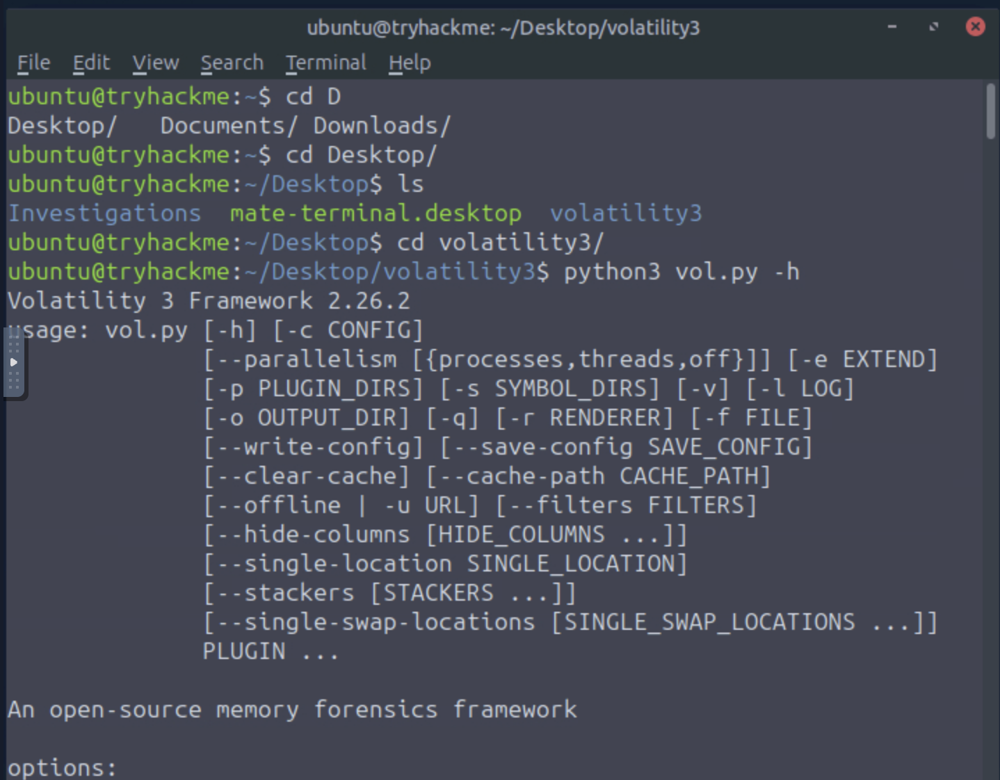

# Untitled

<p align="center">
  
</p>

$$
\huge \begin{array}{c} \mathbf{\textsf{Royal University of Bhutan,}} \\ \mathbf{\textsf{College of Science and Technology}} \end{array}
$$

$$
\Large \mathbf{\textsf{SWS405: Digital Forensics}}
$$

$$
\Large \mathbf{\textsf{Computing Technologies Department  }}
$$

$$
\large \mathbf{\textsf{Lab Report 2  }}
$$

$$
\large \mathbf{\textsf{Submitted by: Sonam Dorji Ghalley  }}
$$

$$
\large \mathbf{\textsf{Student No: 02230299  }}
$$

## 1. Aim

The purpose of this lab was to gain hands-on experience with digital-forensics skills such as memory analysis, forensic disk imaging, evidence preservation and investigation of digital artefacts.

The lab entailed using Volatility 3 to perform memory analysis and Linux forensic-imaging utilities to perform imaging of a disk and verify the hash values of the acquired images. Additionally, FTK Imager and ExifTool were used to investigate a case scenario while ensuring evidence integrity andChain of Custody.

## Objective

The objectives of this practical were to:

- Develop an understanding of the concepts of memory forensics and forensic disk imaging.
- Apply Volatility 3 to a Windows memory dump to identify processes, parent processes, DLLs, handles, and other artefacts.
- Detect potential process injection and memory-resident executable content.
- Analyse the memory image of an infected system with ransomware.
- Examine block devices in the Linux OS before forensic acquisition.
- Perform a forensic acquisition of a disk image using dc3dd.
- Calculate hash values to verify evidence integrity.
- Mount the forensic disk image on a computer without altering the evidence on the original storage media.
- Examine the concept of write-blocking devices.
- Become familiar with the FTK Imager tool.
- Recover deleted files from digital evidence.
- Detect intentionally misleading file names; conduct research with ExifTool to examine the contents of the recovered files.
- Become familiar with the principles of the Chain of Custody procedures.
- Reconstruct the evidence from the fictional Case B4DM755.

## 3. What I Understood

### 3.1 Memory Forensics and Volatility

Memory forensics refers to examining the contents of memory, or specifically, Random Access Memory (RAM). RAM contains information about the current state of a computer that is not present on the hard drive, including the list of current processes, connections, and loaded Dynamic Link Libraries (DLL) and contains encryption keys, injected malicious code, and other data.

An open-source memory-forensics framework called Volatility can analyze memory dump files from Windows and Linux operating systems. Volatility 3 uses specialized modules or plugins to extract the needed information from the memory dump.

Important plugins used in this practical included:

- `windows.info` - displays operating-system and memory-image information.
- `windows.pslist` - displays active processes.
- `windows.psscan` - searches memory for process structures.
- `windows.pstree` - displays parent-child process relationships.
- `windows.dlllist` - shows DLL files loaded by processes.
- `windows.handles` - displays handles associated with processes.
- `windows.malfind` -  identifies suspicious executable or injected memory regions.
- `windows.ssdt` -  displays the System Service Descriptor Table.
- `windows.filescan` -  scans memory for file objects.

The Volatility exercise demonstrated how memory analysis can help identify malware that may otherwise be difficult to detect.

### 3.2 Forensic Imaging

Forensic imaging is the process of making an exact bit-for-bit copy of a storage device.

Instead of conducting investigation on the disk that was acquired, investigators rather make a forensic copy of the disk and perform their investigation on the forensic copy thus protecting the evidence media from accidental modification.

Cryptographic hashes such as MD5 and SHA1 can be computed for the original device and the forensic image. If the cryptographic hashes match, it proves that the contents of the forensic copy are identical to the source media.

In the Linux forensic-imaging practical, `dc3dd` was used to create raw forensic images.

### 3.3 FTK Imager

FTK Imager is a digital-forensics tool that is used to acquire and analyze storage devices and forensic images.

The main interface of FTK Imager consists of:

- Evidence Tree Pane: This displays the evidence sources and their directory structure.
- File List Pane: This displays the files and folders within a selected directory.
- Viewer Pane: This displays the content of a selected file.
- FTK Imager can also calculate hashes, identify deleted files, export recovered evidence and create forensic disk images.

### 3.4 Chain of Custody

Chain of Custody refers to the documentation and procedures used to record how digital evidence was discovered, collected, transported, examined and stored.

It is important because investigators must be able to demonstrate that evidence has not been modified or tampered with.

It include:

- Properly documenting evidence.
- Hashing and copying evidence.
- Using write-blocking devices.
- Creating forensic images.
- Bagging, sealing and tagging evidence.
- Recording every person who handles evidence.
- Performing analysis on forensic copies rather than original evidence.

## 4. Summary

This practical involved three different assessments.

The first investigation, Volatility Essentials, involved analyzing memory dumps from the Windows operating system to reveal system details, suspicious process, loaded dynamic link library (DLL), process handles, possible injected executable code, and evidence of the WannaCry ransomware.

The second investigation, Forensic Imaging, involved using Linux commands to locate storage devices, create forensic images of digital evidence using dc3dd software, compute their Message Digest algorithm 5 (MD5) hash, and mount them for analysis.

The third investigation, Digital Forensics Case B4DM755, entailed responding to a fictional corporate-espionage scenario by using FTK Imager software to extract a forensic image of the flash drive, analyzing deleted and disguised files, examining the file metadata using ExifTool, and retrieving relevant evidence of other criminal activities.

The lab highlighted the importance of preserving the integrity of digital evidence as it may be admissible in court and therefore needs to be maintained throughout the investigation.

## 5. Detailed Lab Procedure

### LAB 1 – VOLATILITY ESSENTIALS

#### 5.1 Starting Volatility

I started the TryHackMe Volatility Essentials lab machine and opened the terminal.

I navigated to the Volatility directory using:

```
cd ~/Desktop/volatility3
```

I confirmed Volatility was available using:

```
python3 vol.py -h
```

The command displayed the Volatility 3 help menu and available options.



#### 5.2 Investigating Case 001

The first memory image was located at:

```
~/Desktop/Investigations/Investigation-1.vmem
```

The scenario stated that the system was suspected of being compromised by a banking Trojan disguised as an Adobe-related file.

#### 5.3 Obtaining System Information

I used the following command:

```
python3 vol.py -f ~/Desktop/Investigations/Investigation-1.vmem windows.info
```

The command displayed information about the operating system, kernel, symbols and system time.


**Build version:**

```
2600.xpsp.080413-2111
```

**Memory acquisition time:**

```
2012-07-22 02:45:08
```

machine was running Windows XP build `2600.xpsp.080413-2111`.

#### 5.4 Examining Running Processes

I examined the running processes using:

```
python3 vol.py -f ~/Desktop/Investigations/Investigation-1.vmem windows.pstree
```

I searched for the suspicious Adobe-related process.

The process identified was:

```
Reader_sl.exe
```

Its complete executable path was:

```
C:\Program Files\Adobe\Reader 9.0\Reader\Reader_sl.exe
```

The parent process was:

```
explorer.exe
```

The PID of the parent process was:

```
1484
```


i used the command below to find the path for the file `reader_sl.exe` 

```bash
python3 vol.py -f ~/Desktop/Investigations/Investigation-1.vmem -r json windows.pstree
```


#### 5.5 Analysing Loaded DLL Files

I identified the PID of `Reader_sl.exe` and used the DLL plugin.

The Adobe process PID was:

```
1640
```

I ran:

```
python3 vol.py -f ~/Desktop/Investigations/Investigation-1.vmem windows.dlllist --pid 1640
```

I inspected the DLL paths and identified the DLL files located outside the Windows `system32` directory.


Therefore, **three DLL files** used by the suspicious Adobe process were located outside `system32`.

#### 5.6 Examining Process Handles

I examined the handles belonging to PID 1640.

```
python3 vol.py -f ~/Desktop/Investigations/Investigation-1.vmem windows.handles --pid 1640
```


The KeyedEvent identified was `CritSecOutOfMemoryEvent`

#### 5.7 Hunting for Injected Executable Code

The `windows.malfind` plugin was used to identify suspicious executable memory regions.

```
python3 vol.py -f ~/Desktop/Investigations/Investigation-1.vmem windows.malfind
```

An `MZ` header generally indicates the beginning of a Windows Portable Executable file.

Two processes contained suspicious executable headers.


#### 5.8 Examining the System Service Descriptor Table

I examined the SSDT using:

```
python3 vol.py -f ~/Desktop/Investigations/Investigation-1.vmem windows.ssdt
```

To locate `NtCreateFile`, I used:

```
python3 vol.py -f ~/Desktop/Investigations/Investigation-1.vmem windows.ssdt | grep NtCreateFile
```


#### Case 002 - Ransomware Investigation

The second memory image was:

```
~/Desktop/Investigations/Investigation-2.raw
```

The scenario involved a company affected by ransomware.

#### 5.9 Identifying the Suspicious Process

I displayed the process tree:

```
python3 vol.py -f ~/Desktop/Investigations/Investigation-2.raw windows.pstree
```

I located PID 740


#### 5.10 Finding the Malware Executable Path

I examined the loaded modules for PID 740:

```
python3 vol.py -f ~/Desktop/Investigations/Investigation-2.raw windows.dlllist --pid 740
```

The complete path was:


#### 5.11 Identifying the Malware

The name `@WanaDecryptor@`, the executable location and related activity were consistent with:

```
WannaCry
```


Therefore, the malware identified in Case 002 was **WannaCry ransomware**.

To identify file objects loaded from the malware working directory, the appropriate Volatility plugin was:

```
windows.filescan
```

### LAB 2 – FORENSIC IMAGING

#### 5.12 Identifying Block Devices

I started the Forensic Imaging lab machine and opened a terminal.

I displayed the attached block devices using:

```
lsblk
```

or:

```
lsblk -a
```

This allowed me to identify the attached loop devices and their capacities.


#### 5.13 Creating a Forensic Image

The `dc3dd` utility was used to create the disk image.

**Basic command format**

```
sudo dc3dd if=/dev/loop11 of=exercise.img log=imaging_log.txt
```

**Parameters**

- `if=` specifies the source device.
- `of=` specifies the output forensic image.
- `log=` records the imaging operation.

> `/dev/loopX` must be replaced with the actual device identified using `lsblk` in my i have loop11
> 


#### 5.14 Checking Image Integrity

For the provided `exercise.img`, I calculated the MD5 hash:

```
md5sum /home/analyst/exercise.img
```


#### 5.15 Mounting the Provided Image

I created a mount directory:

```
sudo mkdir -p /mnt/newimage
```

I mounted the image:

```
sudo mount -o loop New.img /mnt/newimage
```

I displayed its contents:

```
ls -la /mnt/exercise
```

I then opened the flag file:

```
cat /mnt/exercise/flag.txt
```


#### 5.16 Practical Exercise – Imaging the 1 GB Device

I identified the 1 GB loop device using:

```
lsblk -a
```

I then created a forensic image.

Example:

```
sudo dc3dd if=/dev/loopX of=practical.img log=practical_imaging.txt
```

Again, `/dev/loopX` was replaced with the actual 1 GB loop device displayed on my lab machine.

I calculated its MD5 hash:

```
md5sum practical.img
```

#### 5.17 Mounting the Practical Image

I created another mount directory:

```
sudo mkdir -p /mnt/practical
```

I mounted the forensic image:

```
sudo mount -o loop practical.img /mnt/practical
```

I listed the files:

```
ls -la /mnt/practical
```

I opened:

```
cat /mnt/practical/flag.txt
```

### LAB 3 – DIGITAL FORENSICS CASE B4DM755

#### 5.18 Understanding the Case

The suspect in Case B4DM755 was:

**William S. McClean**

The alleged offences were:

- Corporate espionage
- Theft of trade secrets

My official role in the scenario was:

```
Forensics Lab Analyst
```

For the crime-scene acquisition stage, I was assigned the role:

```
DFIR First Responder
```

The items required to be gathered were:

```
digital artefacts and evidence
```

Before a legal search could take place, investigators required a:

```bash
search warrant
```

#### 5.19 Applying the Digital Forensics Process

Before imaging a drive, investigators should check for:

```
drive encryption
```

To maintain the integrity of original files, they should:

```
Hash and copy
```

Before evidence is transported to the Forensics Laboratory, it should be:

```
Bag, Seal, and Tag the obtained artefact
```

#### 5.20 Crime-Scene Evidence

The only digital artefact discovered at the suspect's residence was a:

```
flash drive
```

The flash drive should be:

```
taking an image
```

The crucial Chain of Custody requirement was:

```
Ensure proper documentation
```

### FTK Imager Investigation

#### 5.21 Starting FTK Imager

I started the TryHackMe machine.

I opened **FTK Imager**.

A write-blocking device should normally be used when attaching original digital evidence because it prevents accidental changes to the evidence.

#### 5.22 Identifying FTK Imager Components

The FTK Imager component that displays a hierarchical view of evidence is:

```
Evidence Tree Pane
```

The component that displays files and folders is:

```
File List Pane
```

The component that displays selected file contents is:

#### 5.23 Checking the Flash Drive for Encryption

In FTK Imager, I selected:

```
File > Add Evidence Item
```

I selected:

```
Physical Drive
```

I selected the Microsoft Virtual Disk.

I then selected:

```
File > Detect EFS Encryption
```


Therefore, the flash drive was **not encrypted using EFS**.

### Creating the Forensic Disk Image

#### 5.24 Acquiring the Flash Drive

I selected:

```
File > Create Disk Image
```

I selected:

```
Physical Drive
```

and chose the Microsoft Virtual Disk.

I enabled:

```
Verify images after they are created
```

and:

```
Create directory listings of all files in the image after they are created
```

I clicked **Add** and selected:

```
Raw (dd)
```

I entered the case information, selected the destination and started the image-acquisition process.


#### 5.25 Verifying the Image

After imaging was completed, FTK Imager calculated cryptographic hashes for the source drive and forensic image.

The SHA1 hash was:

```
d82f393a67c6fc87a023b50c785a7247ab1ac395
```

The matching hashes confirmed that the forensic image was an accurate copy of the original evidence.


#### 5.26 Mounting the Forensic Image

I selected:

```
File > Add Evidence Item > Image File
```

I selected the forensic image that had been created.

The image appeared in the **Evidence Tree Pane**.

I then examined the files in the **File List Pane**.

Including hidden files, the flash drive contained:

```
8
```

files.


#### 5.27 Recovering Deleted Files

Deleted files were identified by the deleted-file indicator in FTK Imager.

The total number of deleted files was:

```
6
```

I exported the deleted files for examination.

Of the recovered files:

```
3
```

were corrupted or had a file size of zero.


### Forensic Analysis of Recovered Evidence

#### 5.28 Identifying ExifTool

Inside the tools directory, another forensic utility was available.

Its directory was:

```
exiftool-12.47
```

ExifTool was used to investigate metadata associated with recovered files.


#### 5.29 Investigating the Hideout File

A recovered file called `hideout` appeared to have the extension:

```
.pdf
```

However, examination of its metadata/file signature showed that it was actually:

```
.jpg
```

I used ExifTool to inspect it.

Example:

```
exiftool.exe hideout.pdf
```

The important metadata showed:

```
File Type: JPEG
File Type Extension: jpg
Camera Model Name: ONEPLUS A6013
```

Therefore:

**Visible extension:**

```
.pdf
```

**Actual extension:**

```
.jpg
```

#### 5.30 Investigating the Warehouse Image

I examined the metadata of the recovered warehouse photograph.

The phone model used to take the warehouse photograph was:

```
Mi 9 Lite
```


#### 5.31 Discovering Additional Criminal Activity

Further examination revealed another suspicious/obfuscated file.

Its contents indicated that the suspect was involved in additional illegal activities.

#### 5.32 Identifying the 2022 Point of Contact

The recovered material contained annual meetup and distribution information.

For 2022, the suspect's point of contact was:

```
Karl Renato Abelardo
```

The meetup coordinates were:

```
14°26'25.7"N 120°59'00.8"E
```


#### 5.33 Extracting pandorasbox.zip

The recovered notes contained the password:

```
DarkVault$Pandora=DONOTOPEN!K1ngCr1ms0n!
```

I used the password to extract:

```
pandorasbox.zip
```


#### 5.34 Investigating the Stolen Source Code

Inside the extracted `pandorasbox` directory was source code for a high-frequency trading application.

The header in `main.py` identified the company as:

```
SwiftSpend Financial
```

Therefore, the source code had originated from **SwiftSpend Financial**.


#### 5.35 Identifying the Beneficiary

I examined the documents recovered from the archive.

One document that had not yet been signed identified the principal beneficiary as:

```
Mr. Giovanni Vittorio DeVentura
```


#### 5.36 Recovering the Hidden Flag

Further examination of the recovered data revealed the hidden TryHackMe flag:


```
THM{sCr0LL_sCr0LL_cL1cK_cL1cK_4TT3NT10N_2_D3T41L5_15_CRUC14L!!}
```

## 6. Overall summary

Through this lab I developed practical skills in three important areas of digital forensics.

Volatility demonstrated how volatile memory can reveal evidence about suspicious processes, process relationships, DLLs, handles, executable memory regions and ransomware activity. Analysis of Case 002 found WannaCry ransomware and demonstrated how memory artefacts can be used to recreate malicious activity.

The forensic-imaging practical demonstrated how to use a storage device to create a bit-by-bit forensic image. Hashing provided a way of verifying that the forensic image had not been modified whereas mounting the forensic image permitted files to be examined without working directly on the original source.

Finally, Case B4DM755 demonstrated the full digital-forensics process from crime-scene evidence collection through forensic acquisition and analysis. FTK Imager and ExifTool were used to identify deleted, corrupted and disguised files and to recover evidence from the suspect's flash drive. The investigation also demonstrated the importance of Chain of Custody, documentation, hashing and evidence preservation when digital evidence may be used in legal proceedings.